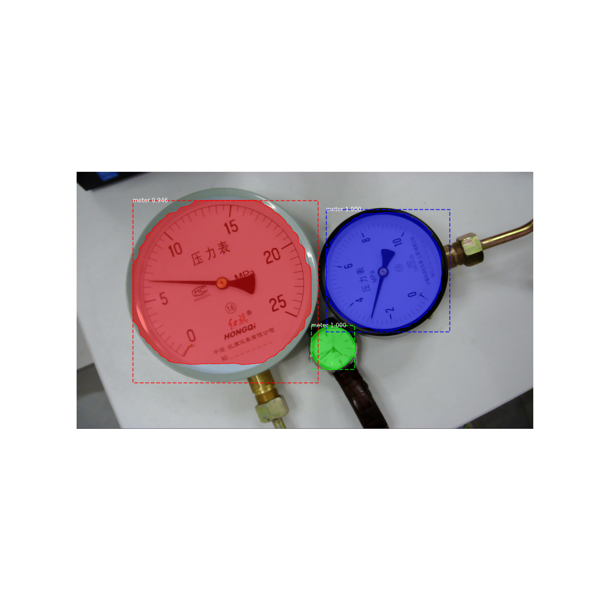
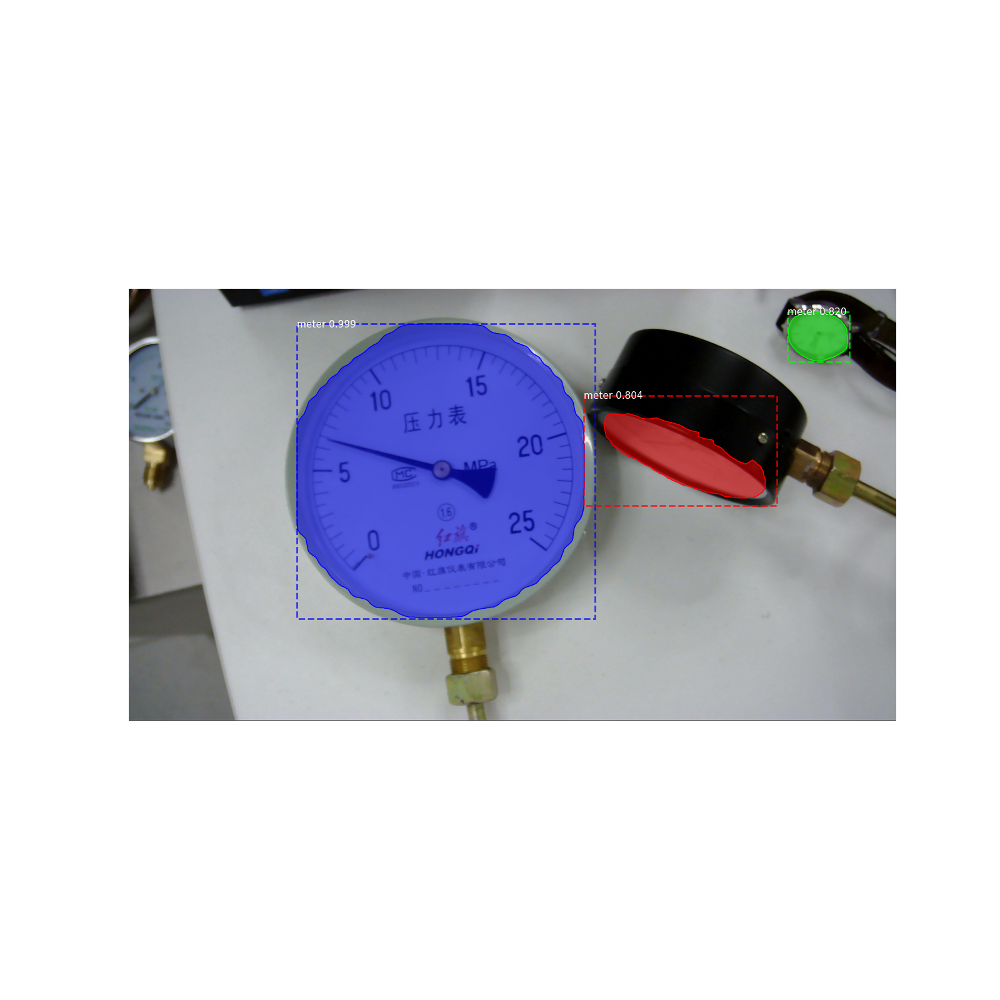

# Use Mask-RCNN to detect dial meter

## Environments

- OS: Ubuntu 18.0

- python: 3.7

- tensorflow: 2.5

- GPU: Nvidia Geforce RTX 3090 with 12GB memory

## Whats' new

- Use Data augmentation

- Use auxiliary network

- Use PANet to improve the accuracy

## some  Tries:
- Use  SeNet ------ wrong 

- use resnetV2 -------wrong

- use res2net ------wrong

## Results shown:

